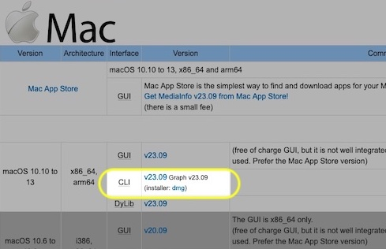
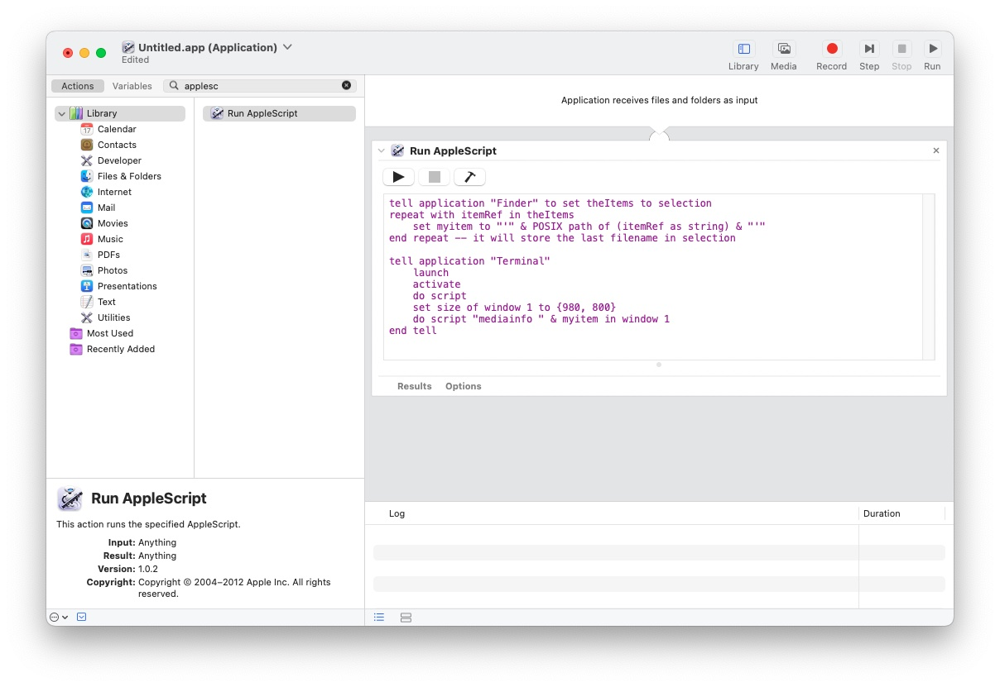
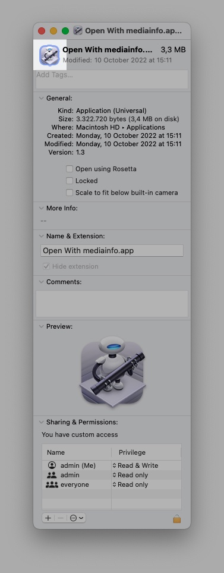
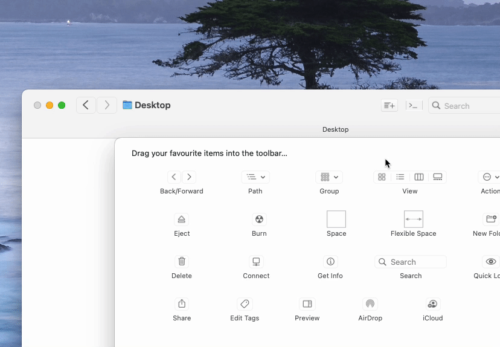

# MEDIAINFO-FINDER
Finder Toolbar app to open MediaInfo of selected video in Terminal.

See steps below.

# PREREQUISITES
Install CLI (=Command Line Interface) of MediaInfo.



## CREATE AUTOMATOR SCRIPT
1. Start Automator.
2. Create New docoment with cmd+n (or from the menu bar: File -> New).
3. Choose Application as type for your document.
5. Search "Run Applescript" in left pane.
6. Drag the "Run Applescript" in right pane.
7. Replace the default script with:
```
tell application "Finder" to set theItems to selection
repeat with itemRef in theItems
    set myitem to "'" & POSIX path of (itemRef as string) & "'"
end repeat -- it will store the last filename in selection

tell application "Terminal"
    launch
    activate
    do script
    set size of window 1 to {980, 800}
    do script "mediainfo " & myitem in window 1
end tell
```
8. Save it as 'OpenwithMediaInfo.app' in your Applications folder.



## ADD OPENWITHMEDIAINFO ICON TO THE APP
1. Copy (cmd+c) "OpenWithMediaInfo-icon.png".
2. Select the OpenWithMediaInfo.app in your Applications folder and press cmd+i to open the app info window.
3. Click the small icon in the top.
4. Paste with cmd+v.




## ADD OPENWITHMEDIAINFO APP TO YOUR FINDER TOOLBAR
1. Open two Finder windows.
2. Right click toolbar -> Customise Toolbar (your toolbar items will start shaking).
3. Use the other window to navigate to your Applications folder.
4. Drag the MediaInfoScript.app to the Toolbar.


